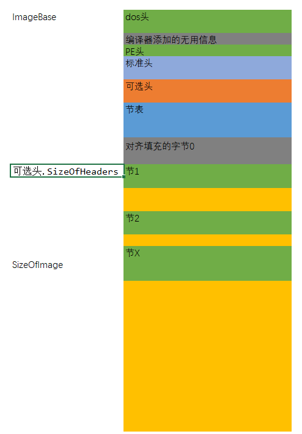

## nodejs 解析静态PE文件

```
import * as fs from "fs";

import { PE_FILE } from "node-pe-file";

fs.readFile("C:\\Users\\ajanuw\\Desktop\\game2.exe", (er, data: Buffer) => {
  const pe = new PE_FILE(data);
  console.log(pe);
});
```

## 导出表
```
fs.readFile("C:\\Windows\\System32\\opengl32.dll", (er, data) => {
  const pe = new PE_FILE(data);
  const ed = CREATE_IMAGE_EXPORT_DIRECTORY(pe, data);
  const edp =  new IMAGE_EXPORT_DIRECTORY_PARSE(pe, ed, data);
  console.log(edp.exports);
});
```

## 重定位表
```
fs.readFile("C:\\Windows\\System32\\opengl32.dll", (er, data) => {
  const pe = new PE_FILE(data);
  const deb = CREATE_IMAGE_DIRECTORY_ENTRY_BASERELOC(pe, data);
  console.log(arrayLast(deb));
  console.log(
    new IMAGE_DIRECTORY_ENTRY_BASERELOC_PARSE(pe, arrayLast(deb), data)
  );
});
```

## 导入表
```
fs.readFile("C:\\Windows\\System32\\opengl32.dll", (er, data) => {
  const pe = new PE_FILE(data);
  const imp = CREATE_IMAGE_DIRECTORY_ENTRY_IMPORT(pe, data);
  imp.forEach((it) => {
    const p = new IMAGE_DIRECTORY_ENTRY_IMPORT_PARSE(pe, it, data);
    console.log(p.Name.toString());
    p.FirstThunk.forEach((name) => {
      console.log("  " + name?.name?.Name.toString());
    });
  });

});
```

- [高清PDF](http://www.openrce.org/reference_library/files/reference/PE%20Format.pdf)
- [microsoft 文档](https://docs.microsoft.com/en-us/windows/win32/debug/pe-format)
- 需要注意在x86和x64中有些属性的大小是不同的,比如可选头中的由有几个值，还有解析导入表时
- option_header.BaseOfData 在x86是DWORD，在x64被合并到了 option_header.ImageBase
- option_header.ImageBase 在x86是DWORD，在x64中是QWORD, 可以看看: https://docs.microsoft.com/en-us/windows/win32/debug/pe-format#optional-header-standard-fields-image-only
- 解析导入表时，在x86和x64需要注意的: https://docs.microsoft.com/en-us/windows/win32/debug/pe-format#import-lookup-table



